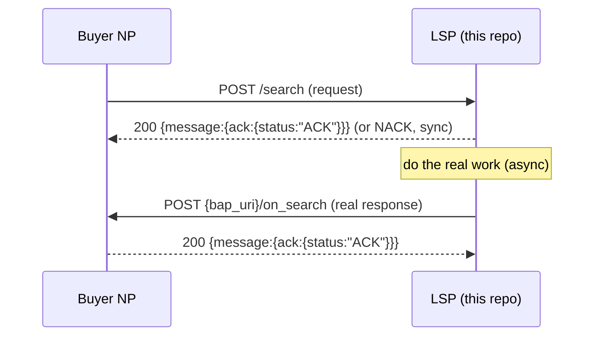

# ONDC Logistics — Envelope & Async Pattern

Source: ONDC API Contract for Logistics v1.2.0. This file covers what's shared across
**every** API pair. Read the specific `docs/ondc/<action>.md` for that module's fields.

## Who's who

- **Buyer NP (BAP)**: currently the retail seller NP that placed the order, acting as
  logistics buyer. Sends `/search`, `/init`, `/confirm`, `/status`, `/update`, `/cancel`, `/track`.
- **LSP (BPP, this repo)**: the seller NP for logistics. Receives the above, responds with
  `/on_search`, `/on_init`, `/on_confirm`, `/on_status`, `/on_update`, `/on_cancel`, `/on_track`.

## Async request/response pattern

Every API is fire-and-forget + callback, never a synchronous response body:



- The first response is **only** an ACK/NACK of whether the request was well-formed — never
  the actual answer.
- The actual answer goes out later as a new outbound POST to `context.bap_uri + '/on_<action>'`,
  signed the same way as any other request.
- `transaction_id` + `message_id` correlate a request to its callback. A stale request/response
  (older timestamp for the same `transaction_id`+`message_id` pair already processed) should be
  discarded / NACKed with error code `65003`.

## Context envelope (present on every request & response)

```json
{
  "domain": "nic2004:60232",
  "country": "IND",
  "city": "std:080",
  "action": "search",
  "core_version": "1.2.0",
  "bap_id": "logistics_buyer.com",
  "bap_uri": "https://logistics_buyer.com/ondc",
  "bpp_id": "lsp.com",
  "bpp_uri": "https://lsp.com/ondc",
  "transaction_id": "T1",
  "message_id": "M1",
  "timestamp": "2023-06-06T21:00:00.000Z",
  "ttl": "PT30S"
}
```

- `bpp_id`/`bpp_uri` are absent on the buyer NP's initial request (they don't know who'll answer
  yet) and present on every callback.
- `ttl` is how long the buyer NP will wait for the ACK — process/enqueue fast, respond within it.
- `domain` is fixed to `nic2004:60232` (logistics) for this project.

## ACK / NACK

```json
// ACK
{ "message": { "ack": { "status": "ACK" } } }

// NACK
{ "message": { "ack": { "status": "NACK" } }, "error": { "code": "60009", "message": "..." } }
```

NACK when the payload fails validation (missing required field, bad enum). This repo's
`buildAck()`/`buildNack()` live in `src/common/ondc/ack.ts`.

## Error codes

Domain error codes are assigned per-API in the spec's own text (e.g. `/cancel` invalid reason →
`60009`) rather than one central table in the contract text. Only implement the codes a given
module's doc file calls out — don't invent a shared error-code enum until a second module needs
one code the first module also uses.

## Signing / verification

See `docs/ondc/auth.md`.

## Common enums used across multiple APIs

- **Category id**: `"Standard Delivery"` (parent) → children `"Immediate Delivery"` (S2D ≤ 60
  min), `"Same Day Delivery"`, `"Next Day Delivery"`; `"Express Delivery"` (ship by air, its own
  set of options) vs `"Standard Delivery"` (ship by surface).
- **Fulfillment type**: `"Delivery"`, `"Return"` (old `"CoD"/"Prepaid"` → `"Delivery"`, old
  `"Reverse QC"` → `"Return"`).
- **Shipment type** (item `descriptor.code`): `"P2P"` (point-to-point, rider goes pickup→drop
  directly) vs `"P2H2P"` (point-to-hub-to-point, routed through a hub — different packaging/AWB).
- **Weight unit**: `"kilogram"`, `"gram"`. **Distance unit**: `"mile"`, `"kilometer"`, `"meter"`.
- **Payment type**: `"ON-ORDER"` (prepaid), `"ON-FULFILLMENT"` (CoD), `"POST-FULFILLMENT"`.
