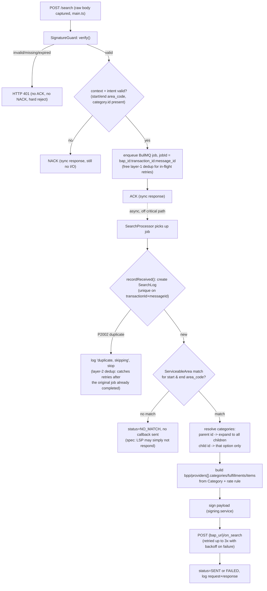

# `/search` → `/on_search`

Buyer NP asks "can you move this package, and what are my options"; LSP does a serviceability
check and returns a catalog of fulfillment options. See `docs/ondc/overview.md` for the shared
context envelope and ACK/NACK pattern first.

## Module flow (this repo)

Every step up to and including ACK is **CPU-only or a single Redis round-trip** — zero DB I/O
before ACK. All DB writes and the outbound callback happen in the worker, off the critical path.



## `/search` request — key fields

```json
{
  "context": { "...": "see overview.md", "action": "search" },
  "message": {
    "intent": {
      "category": { "id": "Immediate Delivery" },
      "fulfillment": {
        "type": "Delivery",
        "start": { "location": { "gps": "...", "address": { "area_code": "560041" } } },
        "end":   { "location": { "gps": "...", "address": { "area_code": "560001" } } }
      },
      "payment": { "type": "POST-FULFILLMENT" },
      "@ondc/org/payload_details": {
        "weight": { "unit": "kilogram", "value": 1 },
        "dimensions": { "length": {...}, "breadth": {...}, "height": {...} },
        "category": "Grocery",
        "value": { "currency": "INR", "value": "300.00" },
        "dangerous_goods": false
      }
    }
  }
}
```

- `category.id` enum: `"Express Delivery"`, `"Standard Delivery"` (parents) |
  `"Immediate Delivery"`, `"Same Day Delivery"`, `"Next Day Delivery"` (children of Standard).
- If parent `"Standard Delivery"` is searched, **must** return all matching child options too.
  If a specific child is searched, return only matching options for that child (or don't respond).
- `dimensions` mandatory for intercity, optional for hyperlocal.
- `fulfillment.start/end.authorization` optional — only if buyer wants pickup/delivery OTP auth;
  if the LSP doesn't support it, don't respond to that search.

## `/on_search` response — key fields

```json
{
  "context": { "...": "see overview.md", "action": "on_search" },
  "message": {
    "catalog": {
      "bpp/descriptor": { "name": "LSP Aggregator Inc" },
      "bpp/providers": [{
        "id": "P1",
        "descriptor": { "name": "LSP Courier Inc" },
        "categories": [{ "id": "Immediate Delivery", "time": { "label": "TAT", "duration": "PT60M" } }],
        "fulfillments": [{ "id": "1", "type": "Delivery" }],
        "locations": [{ "id": "L1", "gps": "...", "address": {...} }],
        "items": [{
          "id": "I1",
          "category_id": "Immediate Delivery",
          "fulfillment_id": "1",
          "descriptor": { "code": "P2P", "name": "60 min delivery" },
          "price": { "currency": "INR", "value": "59.0041" },
          "time": { "label": "TAT", "duration": "PT45M" }
        }]
      }]
    }
  }
}
```

- Category-level `time.duration` is the default TAT; an item can override it with its own `time`.
- `items[].descriptor.code`: `"P2P"` or `"P2H2P"` — drives packaging/AWB decisions downstream.
- An RTO quote item can be linked to its forward item via `parent_item_id`.
- `locations` mandatory only when the shipment must be dropped at an LSP location (not needed
  for pure P2P).
- Optional but useful: `fulfillments[].tags` with `motorable_distance` (OSRM-preferred) and
  `start.time.duration` (avg time to pickup) — improves buyer NP's TAT estimation. Skip for the
  first cut; add once real routing data exists.

## Error handling

No dedicated NACK error code is defined for `/search` itself in the contract — an
unserviceable area or unsupported category means **the LSP simply doesn't send `/on_search`**,
not a NACK. NACK is only for a structurally invalid request (missing `category.id`, missing
`area_code`). An unsigned/forged/expired-signature request never reaches ACK/NACK at all — it's
rejected with **HTTP 401** by `SignatureGuard` before any business logic runs (see `auth.md`).

A retried request (same `transaction_id`+`message_id`, e.g. after a network blip) still gets an
ACK — dedup happens silently in the worker (`SearchProcessor`), which recognizes it via the
`SearchLog` unique constraint and skips reprocessing without sending a second `/on_search`.
